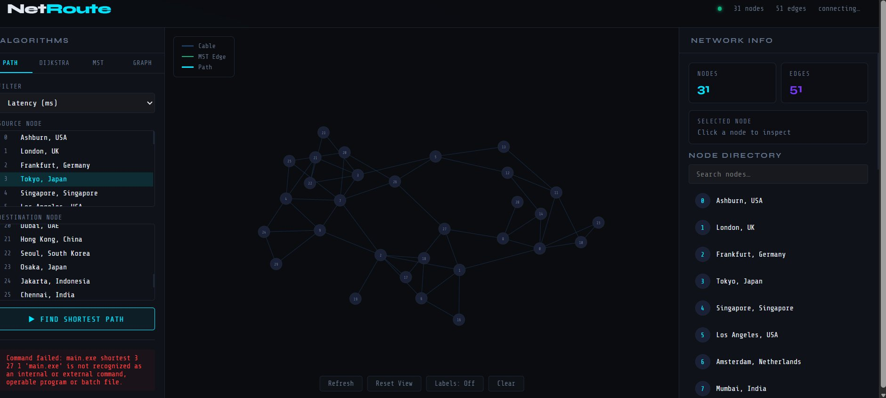
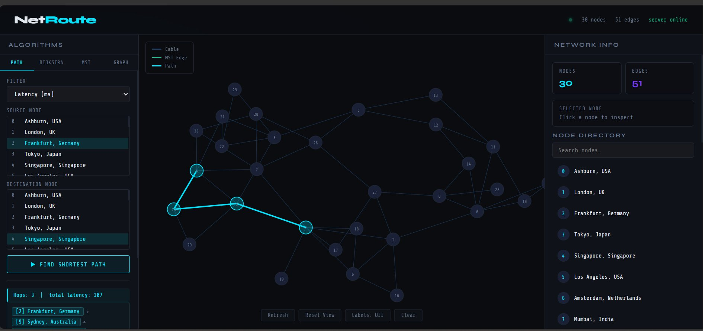
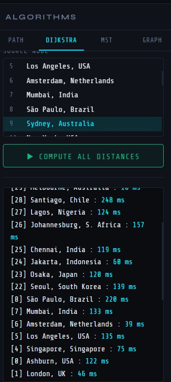
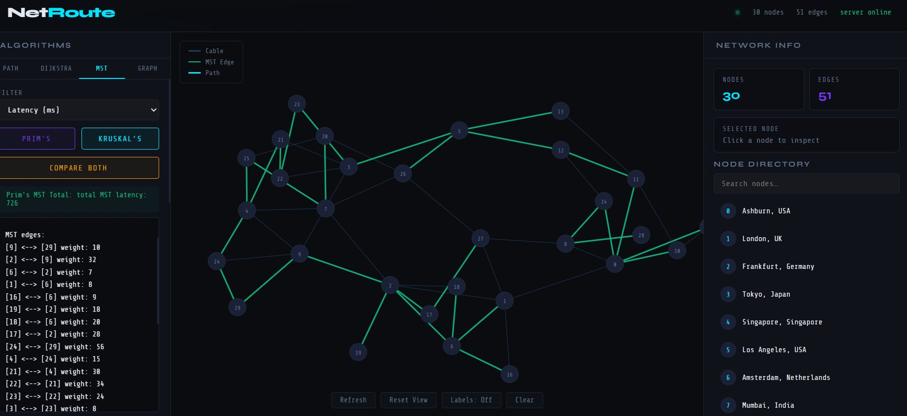
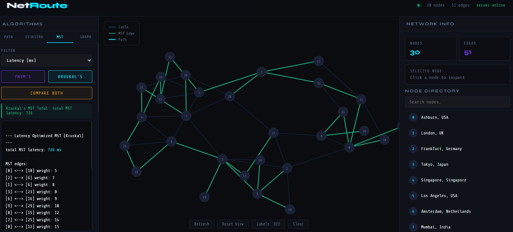
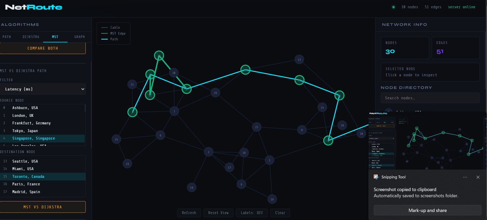
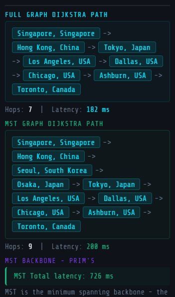
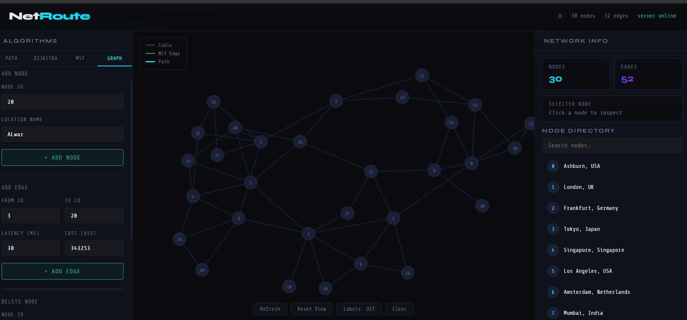

# NetRoute — Network Packet Routing Simulator

A web-based interactive application for visualizing and comparing network packet routing algorithms, implemented with a **C++ computation engine**, **Node.js/Express backend**, and **HTML/JavaScript/D3.js frontend**.

---

## 📸 Overview


*NetRoute — 30-node global topology with real-time algorithm visualization*

---

## ✨ Features

| Feature | Description |
|--------|-------------|
| **Shortest Path (PATH)** | Find the optimal route between two nodes using Dijkstra's algorithm |
| **Dijkstra All** | Compute shortest distances from a source to all nodes (full routing table) |
| **Prim's MST** | Build a Minimum Spanning Tree using Prim's greedy algorithm |
| **Kruskal's MST** | Build a Minimum Spanning Tree using Kruskal's + Union-Find (DSU) |
| **Compare Both** | Side-by-side MST vs Dijkstra path comparison |
| **Graph Editor** | Dynamically add/delete nodes and edges with live re-rendering |
| **Dual Filter** | Switch between **Latency (ms)** and **Cost (USD)** as edge weights |
| **D3.js Visualization** | Interactive force-directed graph with pan, zoom, and drag |

---

## 🏗️ Architecture

```
Frontend (HTML + JS + CSS + D3.js)
           ↓  HTTP POST
Node.js Backend (Express.js)
           ↓  child_process spawn
C++ Executable (main.exe)
           ↓  reads
Data.json (30-node, 51-edge graph)
```

All algorithm logic runs in **C++** — nothing was ported to JavaScript. The Node.js layer only handles API routing and spawning the compiled binary.

---

## 📋 Prerequisites

- **C++17** compiler — `g++` (Linux/macOS) or MSVC (Windows)
- **Node.js** >= 14.0.0
- **npm**
- Modern browser (Chrome, Firefox, Edge)

---

## 🚀 Setup Instructions

### 1. Compile the C++ Engine

```bash
# Development build (with debug symbols)
g++ -std=c++17 -g main.cpp shortest_path.cpp mst.cpp utils.cpp -o main.exe

# Production build (optimized)
g++ -std=c++17 -O3 main.cpp shortest_path.cpp mst.cpp utils.cpp -o main.exe
```

### 2. Install Node.js Dependencies

```bash
npm install
```

### 3. Start the Backend Server

```bash
npm start
```

The server starts on **http://localhost:3000**

### 4. Open the Application

Navigate to **http://localhost:3000** in your browser.

> **Development mode** (auto-restart on file change):
> ```bash
> npm run dev
> ```

---

## 🖥️ Usage

### PATH — Shortest Path (Dijkstra)

Select a **source** and **destination** node, choose a filter (Latency or Cost), and click **FIND SHORTEST PATH**. The optimal route is highlighted in cyan on the graph.


*Frankfurt, Germany → Singapore — 3 hops, total latency 107 ms*

---

### DIJKSTRA — All-Nodes Shortest Path

Select a source node and click **COMPUTE ALL DISTANCES** to generate a full routing table showing distances from that node to every other node in the network.


*All-node distances from Sydney, Australia — Amsterdam (39 ms) to São Paulo (220 ms)*

---

### MST — Prim's Algorithm

Click **PRIM'S** in the MST tab to compute the Minimum Spanning Tree using a greedy priority-queue approach. MST edges are shown in green.


*Prim's MST — total backbone latency: 726 ms, 29 edges listed*

---

### MST — Kruskal's Algorithm

Click **KRUSKAL'S** to compute the MST by globally sorting edges and using Union-Find cycle detection. Produces the same MST as Prim's (total: 726 ms), confirming correctness.


*Kruskal's MST — edges sorted globally (e.g. [0]↔[10]: 5 ms, [2]↔[6]: 7 ms)*

---

### Compare Both — MST vs Dijkstra

Click **COMPARE BOTH** to run MST and Dijkstra simultaneously for the same source-destination pair. This illustrates a key concept: **MST minimises total network cost; Dijkstra minimises individual route cost**.


*Singapore → Toronto: Full Graph (7 hops / 182 ms) vs MST Graph (9 hops / 200 ms)*


*Detailed path comparison — Full Graph Dijkstra is 2 hops shorter and 18 ms faster than MST-constrained routing*

---

### GRAPH — Dynamic Network Editor

Use the GRAPH tab to add or remove nodes and edges live. Each edge accepts both **Latency (ms)** and **Cost (USD)** values, enabling multi-metric analysis.


*Adding a custom node (Alwar) and connecting it to the network*

---

## 🔌 API Endpoints

| Endpoint | Method | Description |
|----------|--------|-------------|
| `/shortest-path` | POST | Dijkstra single pair — `{ from, to, filter }` |
| `/dijkstra-all` | POST | All-nodes shortest path — `{ src, filter }` |
| `/mst/prim` | POST | Prim's MST — `{ filter }` |
| `/mst/kruskal` | POST | Kruskal's MST — `{ filter }` |

**Filter values:** `1` = Latency (ms) · `2` = Cost (USD)

---

## 💻 Command Line Interface

The original CLI mode is fully preserved and can be used without the web server:

```bash
# Interactive CLI
./main.exe

# Shortest path between nodes
./main.exe shortest <from> <to> <filter>

# All-nodes Dijkstra from source
./main.exe dijkstra_all <src> <filter>

# Prim's MST
./main.exe mst_prim <filter>

# Kruskal's MST
./main.exe mst_kruskal <filter>

# Filter: 1 = latency (ms), 2 = cost (USD)
```

---

## 📁 File Structure

```
NetRoute/
├── main.cpp              # Entry point — CLI + command-line argument parser
├── shortest_path.cpp     # Dijkstra single-pair + all-nodes implementation
├── mst.cpp               # Prim's MST + Kruskal's MST + Union-Find (DSU)
├── utils.cpp             # Shared utility functions
├── json.hpp              # nlohmann/json single-header library
├── Data.json             # 30-node 51-edge graph (latency_ms + cost_usd per edge)
├── backend.js            # Express.js server + child_process API layer
├── index.html            # Main UI (D3.js graph + three-panel layout)
├── package.json          # Node.js dependencies
├── package-lock.json
├── .gitignore
└── README.md
```

---

## 📊 Data Format

`Data.json` stores the network graph with dual edge weights:

```json
{
  "nodes": [
    { "id": 0, "location": "Ashburn, USA" },
    { "id": 1, "location": "London, UK" }
  ],
  "links": [
    { "source": 0, "target": 1, "latency_ms": 75, "cost_usd": 12000 }
  ]
}
```

The graph includes **30 global nodes** (Ashburn, London, Frankfurt, Tokyo, Singapore, Mumbai, Sydney, São Paulo, Lagos, Dubai, and more) with **51 edges** representing real-world internet exchange connections.

---

## ⚡ Algorithm Complexity

| Algorithm | Time Complexity | Space | Core Data Structure |
|-----------|----------------|-------|---------------------|
| Dijkstra (single pair) | O((V+E) log V) | O(V+E) | Adjacency list + Min-heap |
| Dijkstra (all nodes) | O((V+E) log V) | O(V+E) | Adjacency list + Min-heap |
| Prim's MST | O(E log V) | O(V+E) | Priority queue + visited array |
| Kruskal's MST | O(E log E) | O(V+E) | Union-Find (DSU) + sorted edges |

*V = 30 nodes, E = 51 edges in the default topology.*

---

## 🔧 Troubleshooting

| Problem | Solution |
|---------|----------|
| Compilation errors | Ensure all `.cpp` files and `json.hpp` are in the same directory; verify C++17 support |
| Server not starting | Check if port 3000 is in use: `lsof -i :3000` |
| API errors (`main.exe` not found) | Ensure `main.exe` is compiled and in the same directory as `backend.js` |
| Graph not loading | Verify `Data.json` exists and is valid JSON |
| CORS errors | CORS is enabled by default in `backend.js`; check browser console for details |

---

## 📝 Important Notes

- All algorithm logic remains in **C++** — no routing logic was moved to JavaScript
- The CLI and web interface provide identical functionality
- CORS is enabled for cross-origin requests
- The graph editor changes are **session-only** — they do not persist to `Data.json`

---

## 📄 License

MIT License
